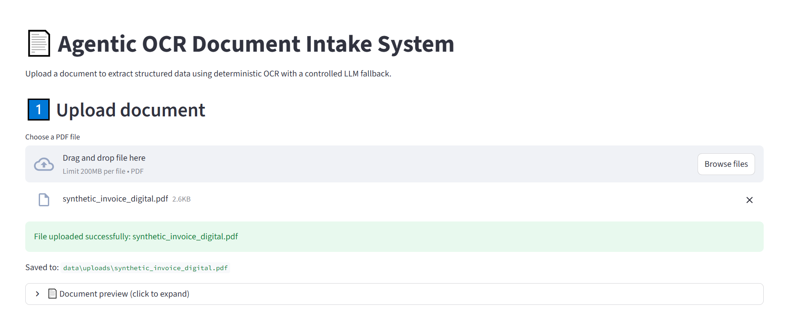
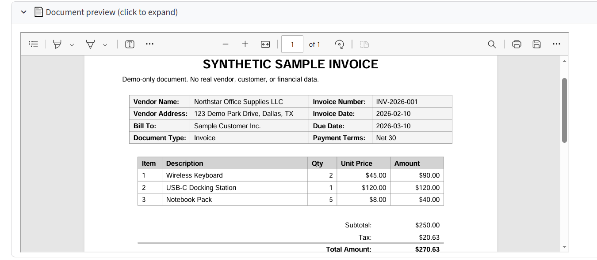
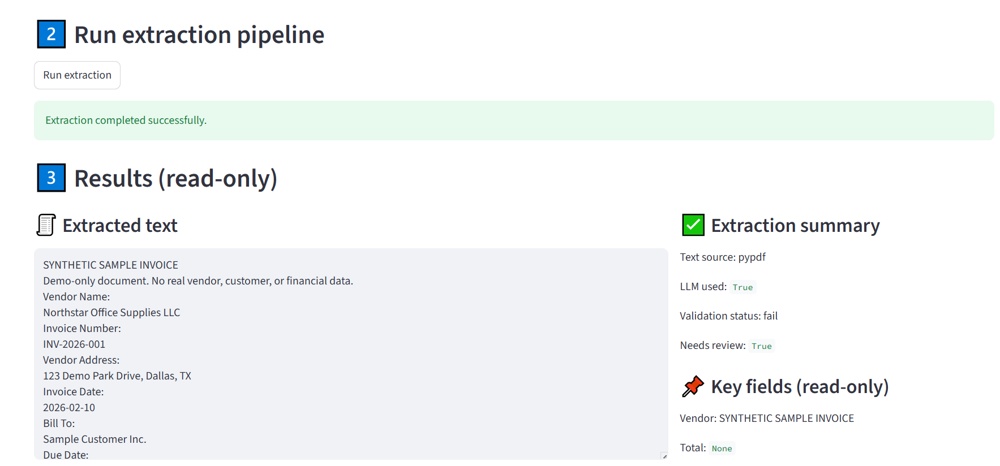
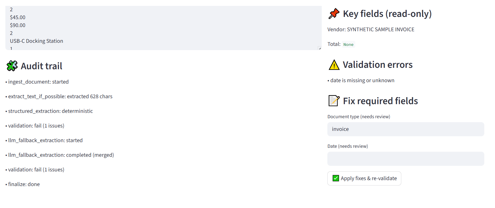
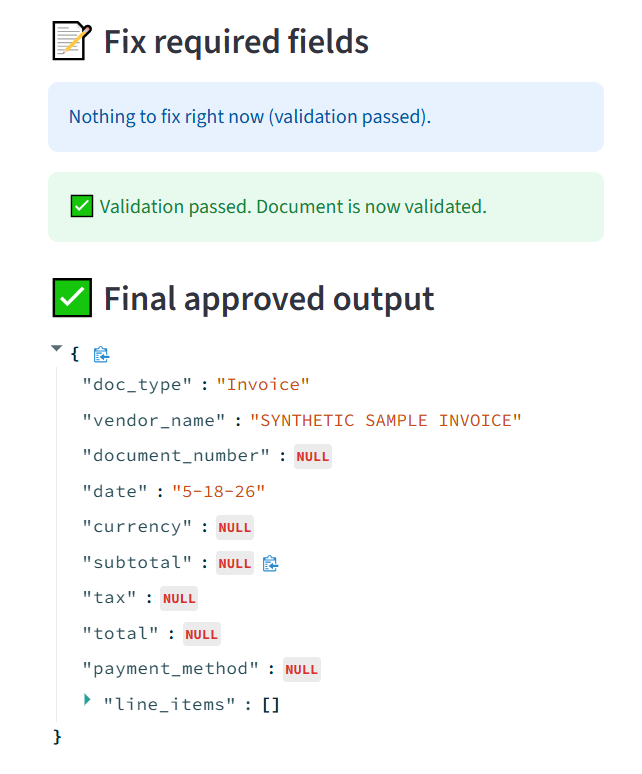
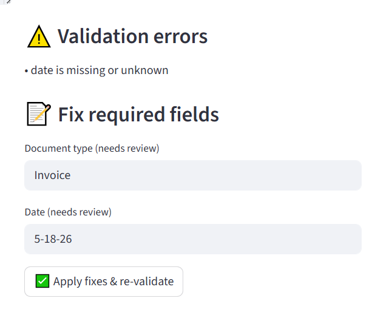
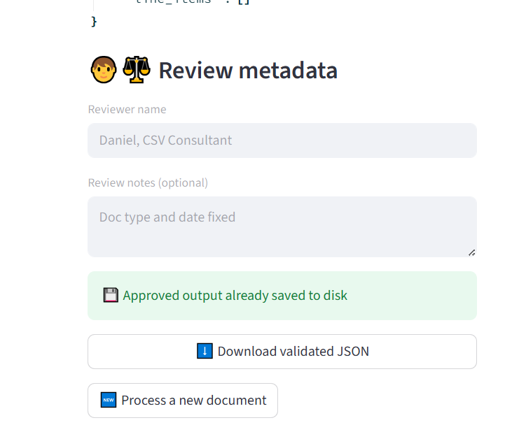

# Agentic OCR Document Intake System: Validation-Oriented AI Document Processing

## 1. Project Overview

The **Agentic OCR Document Intake System** is an AI-assisted document processing application designed to extract, validate, review, and save structured information from invoices, receipts, and purchase orders.

The system uses **Python, LangGraph, Streamlit, Pydantic, OCR, and the OpenAI API** to create a document intake workflow that goes beyond basic OCR. Instead of simply extracting text from a PDF, the application routes documents through a controlled workflow that includes PDF parsing, OCR fallback, deterministic extraction, validation checks, controlled LLM fallback, human-in-the-loop review, and audit-ready JSON output generation.

This project was designed with a production-oriented mindset, especially around **traceability, validation, human review, and controlled AI usage**.

## Detailed Case Study

For a deeper explanation of the project design, workflow, validation strategy, LLM fallback logic, human review process, and audit-ready output structure, see the full case study:

[Read the full case study](CASE_STUDY.md)

## 2. Problem Statement

Many document automation workflows focus only on extracting text from uploaded documents. However, real-world business documents can be inconsistent, scanned, incomplete, or difficult to parse. A simple OCR-only solution may extract text but still fail to provide reliable structured data.

For business workflows such as invoice or receipt processing, the system needs more than raw text extraction. It needs to identify key fields, validate them, handle failures, allow human review, and preserve traceability.

This project addresses that challenge by building a workflow that can:

* Process digital and scanned PDF documents
* Extract key structured fields such as vendor name, date, total amount, and document type
* Validate extracted values before final approval
* Use an LLM only when deterministic extraction is incomplete or invalid
* Allow a human reviewer to approve or correct results
* Save clean and audit-ready JSON outputs

## 3. My Role

I designed and implemented the project end to end as a capstone project. My responsibilities included:

* Designing the document intake workflow
* Building the LangGraph orchestration logic
* Implementing PDF text extraction and OCR fallback
* Creating deterministic extraction and validation logic
* Integrating controlled LLM fallback
* Building the Streamlit review interface
* Designing clean and audit-ready JSON outputs
* Preparing the project for GitHub, resume, LinkedIn, and portfolio showcase

## 4. Tech Stack

* **Python** — core application logic
* **LangGraph** — workflow orchestration and conditional routing
* **Streamlit** — user interface for upload, preview, review, and approval
* **Pydantic** — schema definition and structured data validation
* **pypdf** — text extraction from digital PDFs
* **pdf2image** — PDF-to-image conversion for OCR processing
* **pytesseract / Tesseract OCR** — OCR extraction for scanned documents
* **Poppler** — PDF rendering dependency used with OCR flow
* **OpenAI API** — LLM-assisted fallback extraction
* **JSON** — clean and audit-ready output format

## 5. System Architecture

The system is organized into separate layers so that each part has a clear responsibility.

```text
src/
├── schemas/
│   └── extraction.py
├── tools/
│   ├── pdf_text_extractor.py
│   ├── ocr_pdf_extractor.py
│   ├── deterministic_extractor.py
│   ├── llm_extractor.py
│   ├── merge_utils.py
│   └── validator.py
├── web_app/
│   └── streamlit_app.py
└── workflow/
    ├── graph.py
    └── state.py
```

The architecture separates the application into four main layers:

1. **UI Layer** — Streamlit handles document upload, PDF preview, review, approval, and output access.
2. **Workflow Layer** — LangGraph controls the document processing flow and routing decisions.
3. **Tool Layer** — individual tools handle PDF extraction, OCR, deterministic extraction, LLM fallback, merging, and validation.
4. **Schema Layer** — Pydantic models define the expected structured document fields.

## 6. Agentic Workflow

The workflow is agentic because it makes routing decisions based on document state and validation results. It is not a single static script. The system decides whether to use direct PDF parsing, OCR fallback, LLM fallback, or human review depending on the quality of the extracted data.

```text
ingest_document
        ↓
extract_text_if_possible
        ↓
OCR fallback if needed
        ↓
structured_extraction
        ↓
validation
        ↓
LLM fallback if validation fails
        ↓
validation
        ↓
human review if needed
        ↓
finalize and save outputs
```

Each step updates the document state and adds audit notes so that the processing path remains traceable.

## 7. Validation Strategy

A key design goal was to avoid treating AI output as automatically correct. The system applies validation checks before final approval.

The validation logic checks fields such as:

* Vendor name
* Invoice or document date
* Total amount
* Document type
* Required field completeness

If required fields are missing or invalid, the document is flagged for review. This validation-first approach makes the workflow more reliable and better suited for quality-sensitive environments.

## 8. Controlled LLM Fallback

The system does not send every document directly to an LLM. Instead, it first attempts deterministic extraction and validation.

The LLM fallback is triggered only when:

* deterministic extraction is incomplete,
* required fields are missing,
* validation fails, or
* the document requires additional interpretation.

After the LLM fallback runs, the system re-validates the structured output before allowing final approval. This design reduces unnecessary LLM usage and improves control over the workflow.

## 9. Human-in-the-Loop Review

The Streamlit interface allows a reviewer to inspect extracted fields, correct values, approve the document, and add reviewer details.

This step is important because document automation systems should not blindly accept uncertain or incomplete outputs. Human review provides a safety checkpoint before finalizing the result.

The review interface supports:

* PDF preview
* extracted text review
* structured field review
* validation feedback
* field correction
* reviewer approval
* final JSON output access

## 10. Audit-Ready Outputs

The system generates two types of outputs:

1. **Clean JSON** — structured document data suitable for downstream systems
2. **Audit JSON** — processing metadata, validation status, reviewer details, audit notes, and traceability information

This separation makes the project more realistic. A downstream system may only need clean structured data, while reviewers, auditors, or developers may need the audit version to understand how the result was produced.

## 11. Screenshots

The screenshots below show the end-to-end LLM fallback route, including document upload, PDF preview, extraction, validation feedback, human review, approval, reviewer details, and final JSON output access.

### 11.1 Upload Screen



### 11.2 PDF Preview



### 11.3 LLM Fallback Extraction



### 11.4 Audit Trail and Validation Errors



### 11.5 Human Review and Approved Output



### 11.6 Reviewer Details



### 11.7 Final JSON Output Link



## 12. Challenges and Solutions

### Challenge 1: Handling both digital and scanned PDFs

Some PDFs contain extractable text, while others are scanned images. To handle both cases, I implemented direct PDF text extraction first and OCR fallback when needed.

### Challenge 2: Avoiding uncontrolled LLM usage

A simple approach would be to send every document to an LLM. I avoided this by using deterministic extraction and validation first. The LLM is used only when the workflow determines that fallback is needed.

### Challenge 3: Preserving traceability

Document processing should be explainable. I added audit notes and validation status tracking so the system can show how a document moved through the workflow.

### Challenge 4: Supporting human review

Automation should include a correction path when results are incomplete or uncertain. I built a Streamlit review interface so a reviewer can correct fields and approve the final output.

## 13. What I Learned

This project helped me practice designing an AI workflow that is not only functional but also reviewable and traceable. I learned how to combine deterministic logic, OCR, LLM fallback, validation rules, human review, and audit output generation into one end-to-end system.

It also helped me connect my background in Computer System Validation and QA with applied AI engineering. I approached the project with a validation-oriented mindset, focusing on controlled AI usage, auditability, and review checkpoints.

## 14. Future Improvements

Future improvements could include:

* Adding more synthetic sample documents for public demos
* Adding confidence scores for extracted fields
* Supporting more document types and formats
* Expanding document-specific extraction strategies
* Adding more unit tests for validation and extraction rules
* Improving deployment support for Tesseract and Poppler dependencies
* Adding user authentication for reviewer workflows
* Creating a dashboard for processed document history

## 15. Interview Summary

This project demonstrates how applied GenAI can be combined with validation-oriented workflow design. The system is intelligent enough to use OCR and LLM fallback when needed, but controlled enough to preserve validation checks, human review, and audit-ready outputs.

The strongest value of this project is that it shows not just AI capability, but responsible and reviewable AI workflow design.
